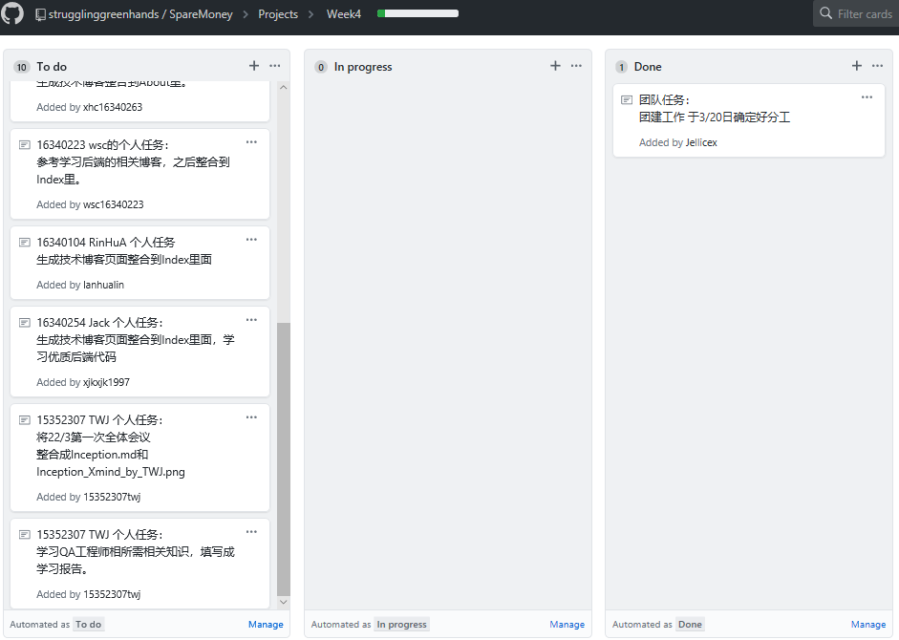
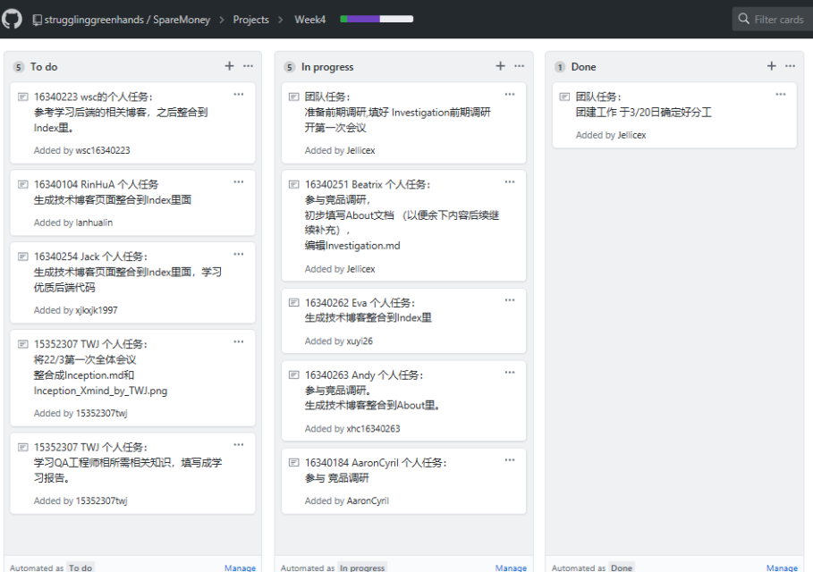

## 1、简答题

### 用简短的语言给出对分析、设计的理解。

- 分析：强调对问题和要求的调查，而不是解决方案。

- 设计：强调满足要求的概念解决方案（在软件和硬件中），而不是其实现。 

### 用一句话描述面向对象的分析与设计的优势。

- 使用相同的建模符号。问题领域的专家和实施的专家可以使用通用符号通信，因此不必担心交流上的问题，双方都能理解，加快进度。

### 简述 UML（统一建模语言）的作用。考试考哪些图？

- UML的作用：
    - UML是标准的图表语言，用于可视化分析和设计的结果。是一种进行面向对象程序设计的工具，用来把现实中的问题抽象成面对对象的解决方案，为交流面向对象的设计中的需求、型为、体系结构的实现提供了一套综合的表示法，以便进一步编码。

- 考试考的图：
> - 用例图：用户角度：功能、执行者
> - 静态图：系统静态结构
>   - 类图：概念及关系
>   - 对象图：某种状态或时间段内，系统中活跃的对象及其关系
>   - 包图：描述系统的分解结构
> - 行为图：系统的动态行为
>   - 交互图：描述对象间的消息传递
>       - 顺序图：强调对象间消息发送的时序
>       - 合作图：强调对象间的动态协作关系
>   - 状态图：对象的动态行为。状态-时间-状态迁移-相应动作
>   - 活动图：描述系统为完成某个功能而执行的操作系列
> - 实现图：描述系统的组成和分布状况
>   - 构建图：组成部件及其关系
>   - 部署图：物理体系结构及与软件单元的对应关系

### 从软件本质的角度，解释软件范围（需求）控制的可行性

- 由于软件本身的复杂性、不可见性、一致性、可变性，软件范围多数情况下对于客户和开发者都是模糊的。软件需求分析要在满足基本需求的基础上，去掉用户不明确的需求，对剩下的需求进行分析、细化，提出完整、准确的需求。

## 2.项目管理实践

- 看板使用练习（提交看板执行结果贴图，建议使用 Git project）
    - 使用截图工具（png格式输出），展现你团队的任务 Kanban
    - 每个人的任务是明确的。必须一周后可以看到具体结果
    - 每个人的任务是1-2项
    - 至少包含一个团队活动任务

- ML绘图工具练习（提交贴图，必须使用 UMLet）
    - 请在 参考书2 或 教材 中选择一个类图（给出参考书页码图号）

教材P7 图1-5

