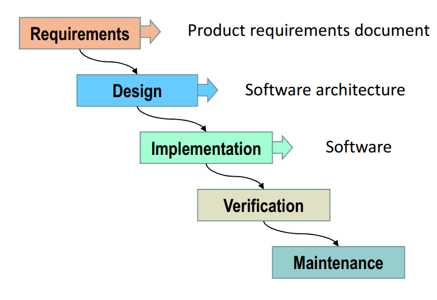
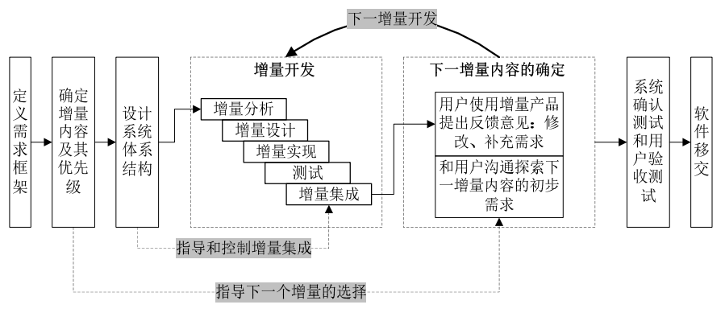
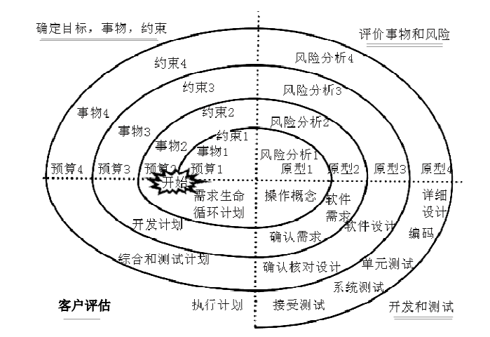

### 1.简述瀑布模型、增量模型、螺旋模型（含原型方法），并分析优缺点(从项目特点、风险特征、人力资源利用角度思考)

- 瀑布模型（Waterfall Model） 是一个项目开发架构，开发过程是通过设计一系列阶段顺序展开的，从系统需求分析开始直到产品发布和维护，每个阶段都会产生循环反馈，因此，如果有信息未被覆盖或者发现了问题，那么最好 “返回”上一个阶段并进行适当的修改，项目开发进程从一个阶段“流动”到下一个阶段.

- 增量模型首先对系统最核心或最清晰的需求进行分析、设计、实现、测试并集成到系统中，再按优先级逐步实现后续需求。

- 螺旋模型是一种演化软件开发过程模型，它兼顾了快速原型的迭代的特征以及瀑布模型的系统化与严格监控。螺旋模型最大的特点在于引入了其他模型不具备的风险分析，使软件在无法排除重大风险时有机会停止，以减小损失。同时，在每个迭代阶段构建原型是螺旋模型用以减小风险的途径。螺旋模型更适合大型的昂贵的系统级的软件应用。

|模型|优点|缺点|
|:--|:--|:--|
|瀑布模型|1.为项目提供了按阶段划分的检查点 2.当前一阶段完成后，您只需要去关注后续阶段 3.可在迭代模型中应用瀑布模型 4.它提供了一个模板，这个模板使得分析、设计、编码、测试和支持的方法可以在该模板下有一个共同的指导|1.各个阶段的划分完全固定，阶段之间产生大量的文档，极大地增加了工作量 2.由于开发模型是线性的，用户只有等到整个过程的末期才能见到开发成果，从而增加了开发风险。 3.通过过多的强制完成日期和里程碑来跟踪各个项目阶段 4.瀑布模型的突出缺点是不适应用户需求的变化。|
|增量模型|1.增强客户对系统的信心； 2.降低系统失败的风险； 3.提高系统可靠性； 4.提高系统的稳定性和可维护性。|1.建立初始模型时，作为增量基础的基本业务服务的确定有一定难度； 2.增量粒度难以选择。|
|螺旋模型|1.设计上的灵活性,可以在项目的各个阶段进行变更。 2.以小的分段来构建大型系统,使成本计算变得简单容易。 3.客户始终参与每个阶段的开发,保证了项目不偏离正确方向以及项目的可控性。 4.随着项目推进,客户始终掌握项目的最新信息 , 从而他或她能够和管理层有效地交互。 5.客户认可这种公司内部的开发方式带来的良好的沟通和高质量的产品。|很难让用户确信这种演化方法的结果是可以控制的。建设周期长，而软件技术发展比较快，所以经常出现软件开发完毕后，和当前的技术水平有了较大的差距，无法满足当前用户需求。|

### 2.简述统一过程三大特点，与面向对象的方法有什么关系？

- 用例驱动
    - 用户（User）：软件系统是为了解决用户的需求的，因此对于一个系统必须首先确定它的用户（User），即参与者。这个User不仅仅指人，也可以是其他系统。即用户是与系统进行交互的事物。
    - 用例（User Case）：是用户对系统的业务需求，即用例是能够像用户提供有价值结果的系统中的一种功能。
    - 所有的用户和用例组合在一起就是用例模型，它描述了系统的全部功能。用例图促使我们从系统对用户的价值方面来考虑问题，是站在用户的角度出发，以人为本。并且用例图不仅能确定用户的需求，还可以驱动系统设计、实现和测试的进行，也就是说用例可以驱动开发过程。用例驱动表明开发过程是沿着一个流——一系列从用例得到的工作流前进的：用例被确定、用例被设计、最后用例又称为测试人员构造测试用例的基础

- 以构架为中心
    -  软件构架的作用与建筑构架所起的作用类似。软件系统的构架是从不同的角度描述即将构造的系统。
    - 注意：软件架构（software architecture），是一系列相关的抽象模式，用于指导大型软件系统各个方面的设计。软件架构是一个系统的草图。它描述的对象是直接构成系统的抽象组件，各个组件之间的连接明确和相对细致地描述组件之间的通讯。在实现阶段，这些抽象组件被细化为实际的组件，在面向对象领域中，组件之间的连接通常用接口来实现。 
    - 软件构架包含了系统中最重要的静态和动态特征。构架刻画了系统的整体设计，去掉了细节部分，突出了系统的重要特性，然而“究竟什么是重要的”部分依赖于判断，而判断由来自于经验，所以构架的价值也就依赖于执行该任务的人的素质，在构架的过程中可以帮助构架师确定正确的目标。

- 迭代和增量
    - 迭代：工作流中的步骤；
    - 增量：产品中增加的部分。

### 3.简述统一过程四个阶段的划分准则是什么？每个阶段关键的里程碑是什么？

- 四个阶段为：初始、细化、构造和移交，每个阶段的以一个里程碑作为结束标记

- 初始阶段的里程碑：生命周期目标(Lifecycle Objective) 里程碑，包括一些重要的文档，如原始业务案例等。需要对这些 文档进行评审，以确定正确理解用例需求、项目风险评估合理、 阶段计划可行等。 
- 精化阶段的里程碑：生命周期体系结构(Lifecycle Architecture) 里程碑。包 括风险分析文档、软件体系结构基线、项目计划、可执行的进化原型、初始版本的用户手册等。通过评审确定软件体系结构 已经稳定、高风险的业务需求和技术机制已经解决、修订的项目计划可行等。 
- 构建阶段的里程碑：初始运行能力里程碑。 包括可以运行的软件产品、用户手册等，它决定了产品是否可 以在测试环境中进行部署。此刻，要确定软件、环境、用户是 否可以开始系统的运行。 
- 交付阶段的里程碑：产品发布里程碑。确定最终目标是否实现，是否应该开始产品下一个版本的另一个开发周期。在 一些情况下这个里程碑可能与下一个周期的初始阶段的相重合。

### 4.软件企业为什么能按固定节奏生产、固定周期发布软件产品？它给企业项目管理带来哪些好处？

- 统一过程模型中，各个阶段的生命周期都是固定的，在产品的迭代开发过程有比较明确的时间限制。企业能够及时交付产品，减少所需的人月，在迭代过程中逐渐完善产品。