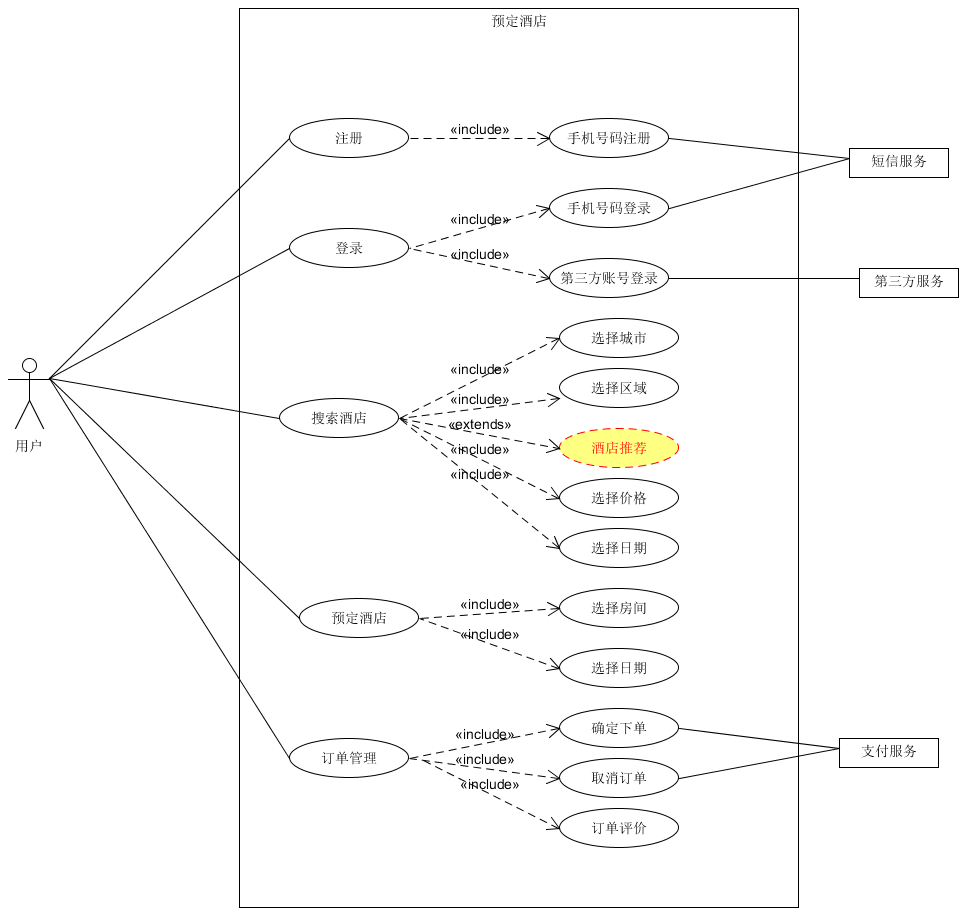

## 1、简答题

- ### 1.用例的概念
    - 在不展现一个系统或子系统内部结构的情况下，对系统或子系统的某个连贯的功能单元的定义和描述。
    - 用例（英语：use case），或译使用案例、用况，是软件工程或系统工程中对系统如何反应外界请求的描述，是一种通过用户的使用场景来获取需求的技术。 
- ### 2.用例和场景的关系？什么是主场景或 happy path？
    - 每个用例提供了一个或多个场景，该场景说明了系统是如何和最终用户或其它系统互动，也就是谁可以用系统做什么，从而获得一个明确的业务目标。用例是场景的抽象，场景是用例的实例。
    - 主场景对应系统主要的交互，通常是成功的场景。
    - 没有异常或错误条件的默认场景，用户和系统可以顺利无误、符合预期进行交互。
- ### 3.用例有哪些形式？
    - 概要型：简洁的一段式概要，通常用于主成功场景
    - 简便型：非正式的段落格式，包含多种场景
    - 完整型：所有的步骤和变化都十分详细
- ### 4.对于复杂业务，为什么编制完整用例非常难？
    - 复杂业务可能涉及很多场景，有些业务难以在用例中描述清楚，甚至一些单个业务都不能考虑到所有的用户-系统交互情况，因此难以编制完整用例。
- ### 5.什么是用例图？
    - 用例图是指由参与者（Actor）、用例（Use Case），边界以及它们之间的关系构成的用于描述系统功能的视图。
- ### 6.用例图的基本符号与元素？
    - 参与者(Actor)
        - 参与者是系统外部与系统直接交互的人或事物，需要注意：参与者是角色，不是具体的某个人。参与者代表了用户与系统交互过程中所扮演的角色，所以在系统的实际使用中，一个用户可能对应着系统的多个参与者，一个参与者也可能对应多个真实的用户。参与者是作为外部用户与系统发生交互的，这是它的主要特征。
        - 符号为一个小人
    - 用例(Use Case)
        - 用例是系统外部可见的一个系统功能单元，系统的功能是由系统功能单元组成和提供的，通过一系列的系统单元与参与者之间交换信息来表达。
        - UML中用例用一个椭圆表示，椭圆中的文字描述系统的功能
    - 系统边界
        - 系统边界表示正在建模系统的边界，边界内表示系统的组成部分，边界外表示系统外部。
        - UML中系统边界用一个方框表示，并附上系统的名称，参与者在边界的外部，用例在边界内。
    - 关联(Association)
        - 表示参与者与用例之间的通信，任何一方都可发送或接受消息。
        - UML表示：用一条直线箭头指向消息接收方
    - 扩展(Extends)
        - 扩展关系是指用例功能的延伸，相当于为基础用例提供一个附加功能。
        - UML表示：用带箭头的虚线指向基础用例
    - 包含(Include)
        - 包含关系用来将一个叫复杂用例所表示的功能分解成较小的部分。
        - UML表示：用带箭头虚线指向分解出来的子功能用例
    - 泛化(Inherits)
        - 泛化用来说明两个用例之间的继承关系，子用例继承父用例的所有结构、行为和关系，但是表现出更特别的行为。
        - UML表示： 用空心箭头指向父用例。
- ### 7.用例图的画法与步骤
    - 确定参与者
    - 确定系统边界
    - 识别用例
    - 确定用例之间的关系
- ### 8.用例图给利益相关人与开发者的价值有哪些？
    - 利益相关人
        - 可以保证系统按照用户的需求进行设计
        - 可以相应需求并调节
    - 开发者
        - 更明确获得并理解需求
        - 指导开发

## 2、建模练习题（用例模型）

- 选择2-3个你熟悉的类似业务的在线服务系统（或移动 APP），如定旅馆（携程、去哪儿等）、定电影票、背单词APP等，分别绘制它们用例图。并满足以下要求：
    - 请使用用户的视角，描述用户目标或系统提供的服务
    - 粒度达到子用例级别，并用 include 和 exclude 关联它们
    - 请用色彩标注出你认为创新（区别于竞争对手的）用例或子用例
    - 尽可能识别外部系统和服务

- 然后，回答下列问题：
    1. 为什么相似系统的用例图是相似的？
        - 相似系统的主要业务逻辑都差不多，可能只是一些细节上的不同，但是主要框架都是一样的。
    2. 如果是定旅馆业务，请对比 Asg_RH 用例图，简述如何利用不同时代、不同地区产品的用例图，展现、突出创新业务和技术
        - 可以根据用户的选择，进行匹配，寻找比较相似的结果
    3. 如何利用用例图定位创新思路（业务创新、或技术创新、或商业模式创新）在系统中的作用
        - 可以通过不同颜色定位该用例图的创新模块，确定其属于的业务范围，再针对实际数据分析它的作用
    4. 请使用 SCRUM 方法，选择一个用例图，编制某定旅馆开发的需求（backlog）开发计划表
    
    |ID|Name|IMP|EST|How to Demo|Notes|
    |:--:|:--:|:--:|:--:|:--:|:--:|
    |1|注册|10|3|手机号作为账户名注册||
    |2|登录|10|3|手机号或者第三方合作登录||
    |3|搜索酒店|30|5|城市、区域、价格、日期等信息|能够正确筛选并返回信息|
    |4|预订酒店|15|4|确定酒店之后，选择房间和日期预定||
    |5|订单管理|10|3|订单进行确认并支付；取消订单|系统内即可支付或者与第三方合作|
    
    5. 根据任务4，参考 使用用例点估算软件成本，给出项目用例点的估算

    |用例|事务|计算|原因|UC权重
    |:--:|:--:|:--:|:--:|:--:|
    |注册|2|2|手机号注册并发送短信作为验证|简单|
    |登录|2|2|手机号登录或者第三方账号登录|简单|
    |搜索酒店|10|8|多种搜索酒店方式并且精确反馈|复杂|
    |预定酒店|5|4|高并发订单处理|一般|
    |订单管理|5|4|多个订单处理|一般|