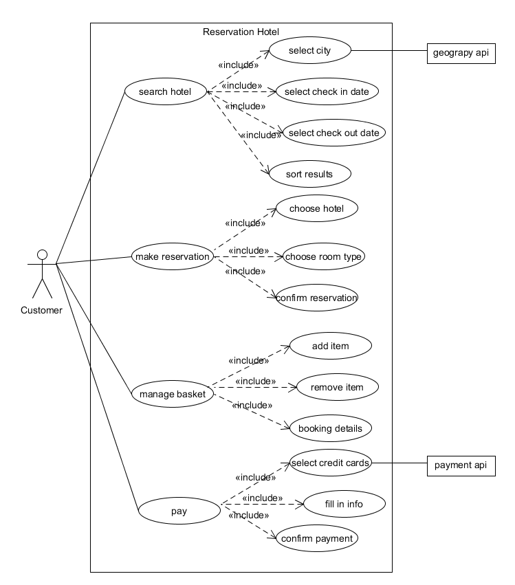
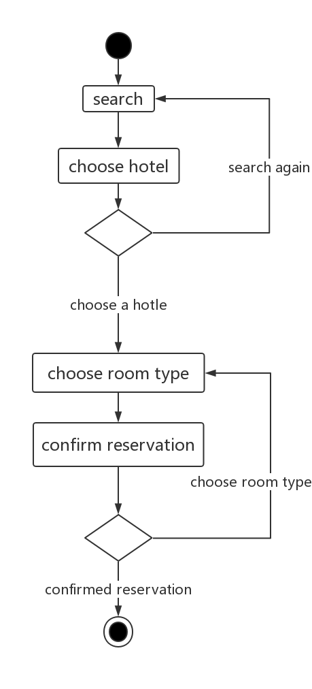
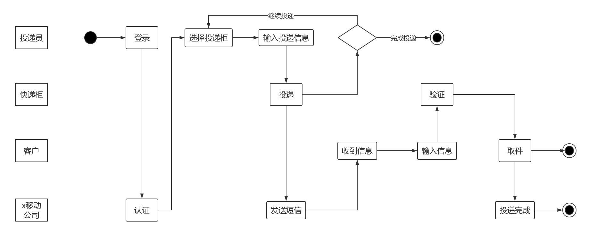
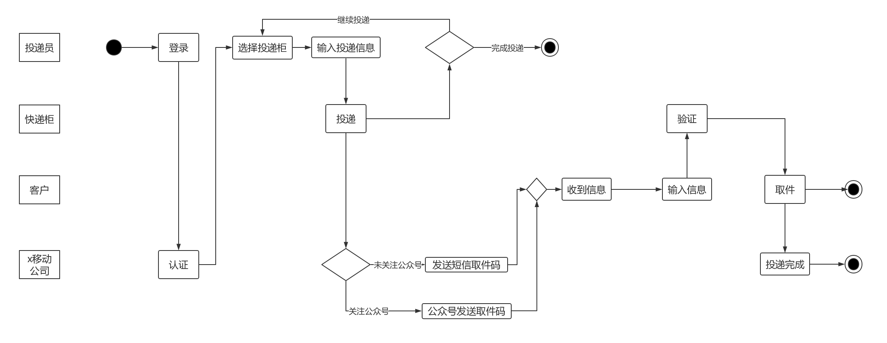
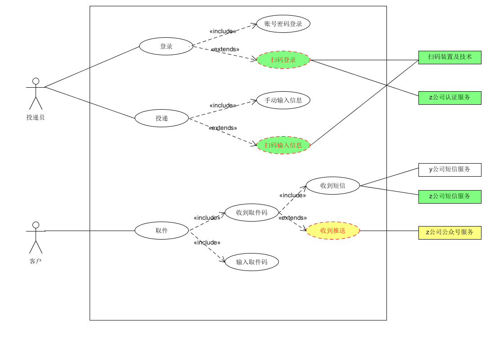

## 使用 UMLet 建模：

### 1、根据订旅馆建模文档，Asg-RH.pdf：
- 绘制用例图模型（到子用例）

- 给出 make reservation 用例的活动图

### 2、根据课程练习“投递员使用投递箱给收件人快递包裹”的业务场景
- 分别用多泳道图建模三个场景的业务过程
    - 场景1
    
    - 场景2
    
    - 场景3
    
- 根据上述流程，给出快递柜系统最终的用例图模型
    - 用正常色彩表示第一个业务流程反映的用例
    - 用绿色背景表述第二个业务场景添加或修改的用例，以及支持 Actor
    - 用黄色背景表述第三个业务场景添加或修改的用例，以及支持 Actor
    