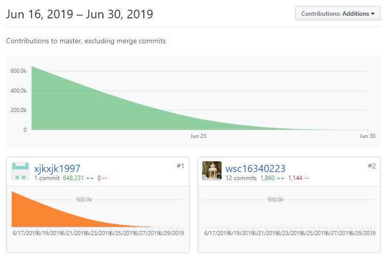
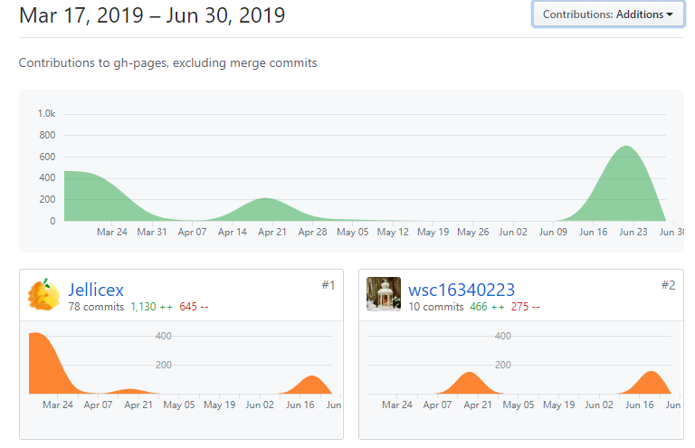

**16340223 王思诚**

## 1. 简短的课程学习自我总结

### 学习收获

&emsp;&emsp;这一次小组项目，可以说是大学中第一次进行规范的项目开发，包括各个项目文档，前后端的配合协作，和之前的一些小组作业是不一样的感觉，可以体会到一个完整的小组项目应该是如何开展与进行的。在这个项目中，我主要参与协助后端的开发与测试，数据库设计以及部分文档的编写。由于是多人协作开发，使用GitHub管理的同时，对git的命令也变得熟悉。每一次开展会议时，大家都在不断讨论，提出自己的想法，也一起为项目进行建模，加深了对课堂知识的理解。

### 特别感谢

&emsp;&emsp;首先要感谢的是后端小组的谢济锴同学，整个项目的框架是他进行搭建的，并且实现了大部分的功能，十分辛苦！同时项目中的每一位成员都是我要感谢的对象，这是一个团队项目，每一位成员都为此出力，十分出色的完成了各自的任务，项目的最终成品是大家不断努力的结果。

## 2. PSP2.1统计表

|PSP2.1|Personal Software Process Stages|Time (%)|
|:--|:--:|:--:|
|**Planning**|计划|10|
|—estimate|预估任务时间|10|
|**Development**|开发|80|
|—analysis|需求分析|10|
|—design spec|生成设计文档|5|
|—estimate|设计复审|5|
|—coding standard|代码规范|3|
|—design|具体设计|15|
|—coding|具体编码|20|
|—code review|代码复审|7|
|—test|测试（修改代码）|15|
|**Report**|报告|10|
|—test report|测试报告|1|
|—size measurement|计算工作量|1|
|—postmortem & process improvement plan|总结与改进8|

## 3. 个人分支的GIT统计报告

- 后端

- 文档

## 4. 自认为最得意/或有价值/或有苦劳的工作清单

- **最得意：** 分析需求，构造最初版本的数据库模型并且在后期完善；学习了新的知识并应用(python&&Django)

- **最有价值：** 协助完成了后端的开发与测试，在测试中寻找之前没有发现的bug并且修复

- **最有苦劳：** 帮助进行前后端的对接，同时找到一款软件(ngrok)可以让外网访问本机运行的网站